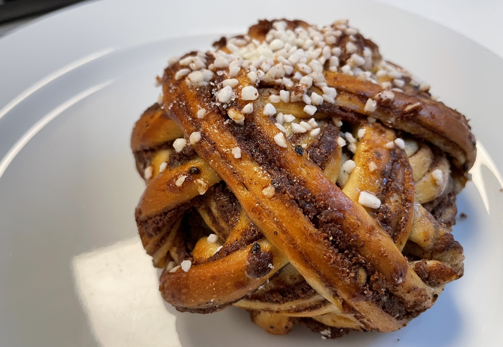
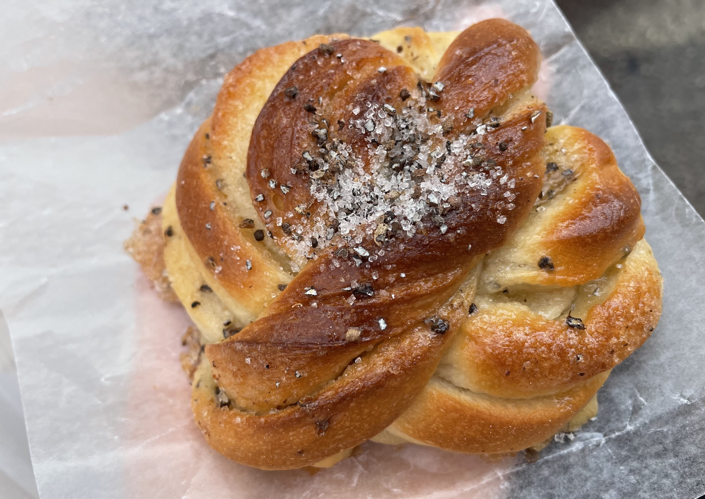
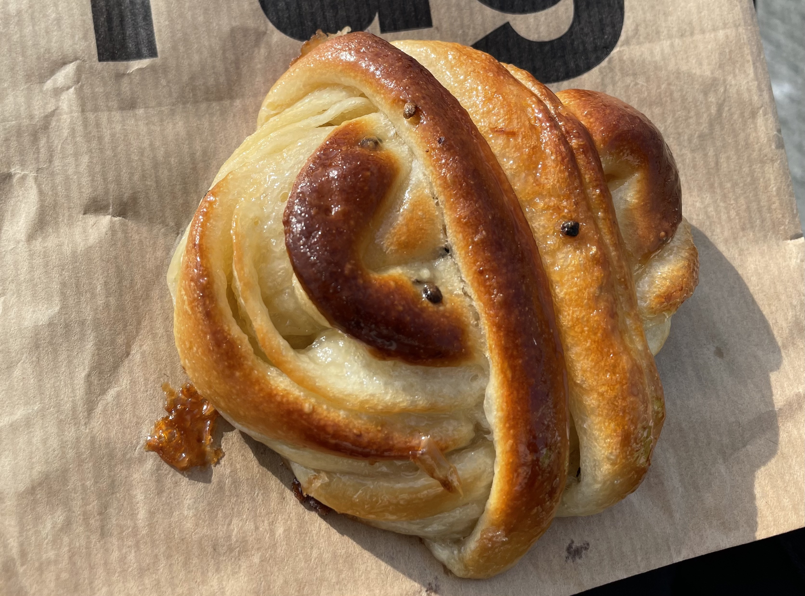
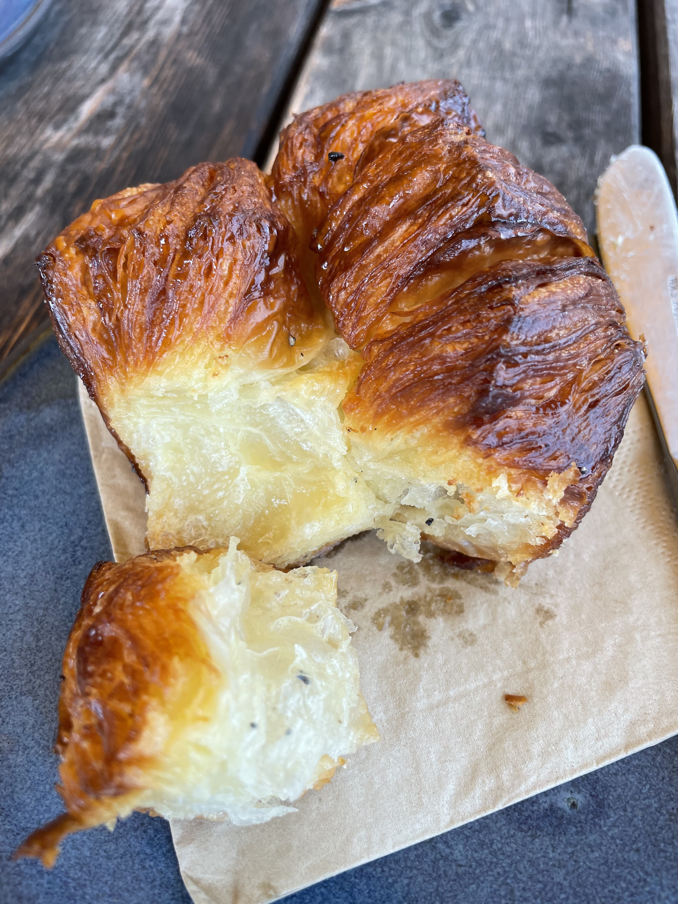
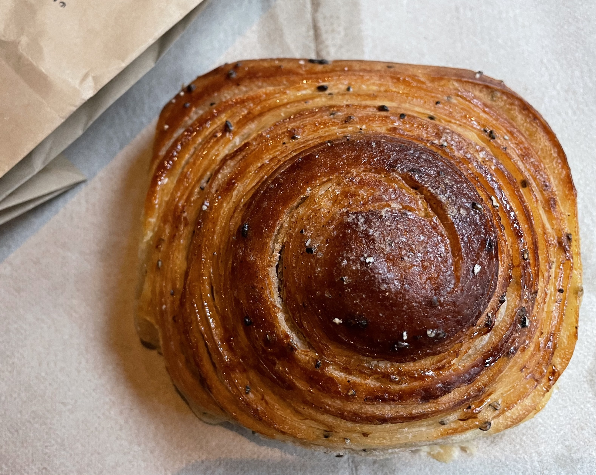

和许多香料一样，小豆蔻是热带和亚热带的产物。但一如许多颠沛的故事，它漂洋过海远渡重洋，最终竟然成了极寒北境里独树一帜的风味。

过去的一年我很少下厨，更遑论上次开烤箱是什么时候。以前凭着单纯的热情和误打误撞的新手光环做过的许多尝试都在搬来纽约之后断崖式停滞了。日复一日里并不觉得这有什么问题，毕竟生活本身就已经够多鸡飞狗跳了，共用的厨房作用寥寥，不再能称作避风港。然而看到the Bear S2EP4里Marcus在哥本哈根搓面团的时候，我还是不可避免得心头一紧——that's someone living my dream life——这个念头异常尖刻地戳在我心上。进而回想起几个月前在北欧匆匆一游的日子，脑子里翻涌起来的，不出意料是小豆蔻的独特香气。

以前提起肉桂卷，我能想起的只有厚重icing覆盖的螺旋形卷的样子。好吃吗，也可以好吃的，是独自发疯时候才会吃的东西，一口下去全靠糖分吊出一点生气回魂，仅供特殊场合，远不到能进日常菜单的地步。更疯的时候也动手做过，手揉重油面团的艰辛不能细想，面团先松弛再擀开，抹上厚厚的肉桂糖霜，卷成长长一条再拿细线分割成一个个带着年轮的小树桩排进烤盘。做一次就能轻松消磨掉一个冬夜，但这种靠疯劲儿催生的冲动却很难再续了。后来在纽约下刀子一样的冷风里走进久负盛名的北欧bakery，才得以认识了美式肉桂卷的远亲，原来肉桂卷也不都是小树桩子。

首先是面团折叠方式。北欧系的肉桂卷（Cinnamon bun，瑞典叫Kanelbullar）多为上图里这种扭结状。也有吃到过扭得更立体的款式，圆圆鼓鼓，简直像一枚竹编小绣球了。小豆蔻包（cardamom bun，kardemummabullar）的形状则更统一，在斯德哥尔摩和哥本哈根吃过的所有店都做成这样的扭结，只是根据蓬发程度而在高矮上有点微妙差异，看起来有一种莫名的喜庆（？）。是需要一点练习门槛的整型手法。

然后是装饰性糖的形态。不同于美式肉桂卷多用厚重的icing，北欧的肉桂卷一般用粗粒糖作为顶饰，小豆蔻卷则是小豆蔻加砂糖的组合，打眼看过去很像小时候吃的芝麻糖干碟（？）。

最后是整体风味。从装饰性糖的剂量已经可以很明显地猜测到，北欧这两只包会比美式肉桂卷在甜度上克制许多，事实也确实如此，肉桂和小豆蔻的香气都能从弱化的甜度里凸显出来，虽然仍属于重油重糖的面团，口味上却要清淡很多。再配合上整型手法的不同，面团蓬发度足够好的话会比显得非常轻盈，颇有点日系甜面团的妥帖。

北欧人民对小豆蔻的喜爱当然不会止步于长盛不衰的经典款，酥皮pastry里也必须要有它一席之地。Cardamom croissant就属于那种看名字我就很难挪动脚步的东西，小豆蔻和北欧久负盛名卷生卷死的croissant放在一起很难难吃吧！然而也许是斯德哥尔摩的标准立得太高了，在哥本哈根吃到的两只cardamom croissant都不尽如人意，美貌有余，口味上却过于厚重了，小豆蔻本身清冽的风味被过重的糖油盖过，有那么一点点暴殄天物。

真正惊艳的也有。在Komet吃到的名叫Venus的这只cardamom croissant让我反复回味，组织介于danish和传统cardamom bun之间，外层克制又精巧的酥皮和内里的柔韧平衡得非常美妙。只可惜第二天再去已经不卖了，真是一期一会的缘分。

在倒时差的清晨晃过斯德哥尔摩老城区的小巷，停在bakery厨房的大玻璃窗前看里面被折叠被团起起、被送进烤炉的面团，仿佛已经是上辈子的美好回忆。上周末托友邻的福，再访Whitney旁边那家Fabrique，cardamom bun竟然比去年在同一家店吃到的那只优秀许多，只能说有些吉光片羽虽然很难复制，但可以在类似的或者全新的体验里产生微妙的联系进而被重复打磨。食物本身作为载体带来的快乐是很容易消散的，但快乐的印象可能我还会回味很久吧。