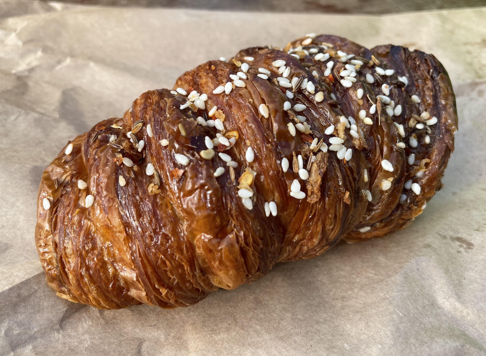
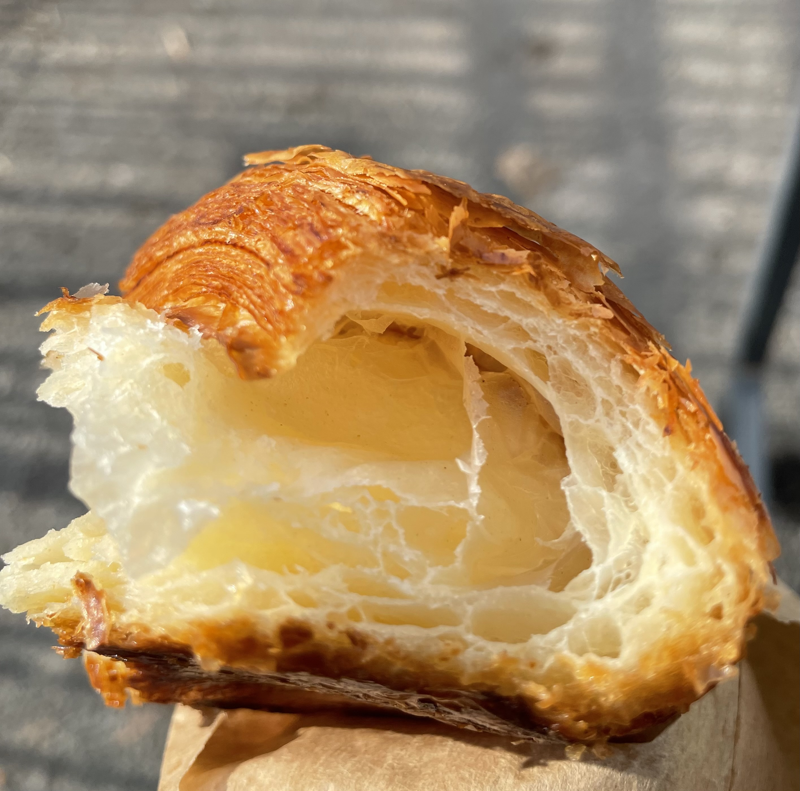
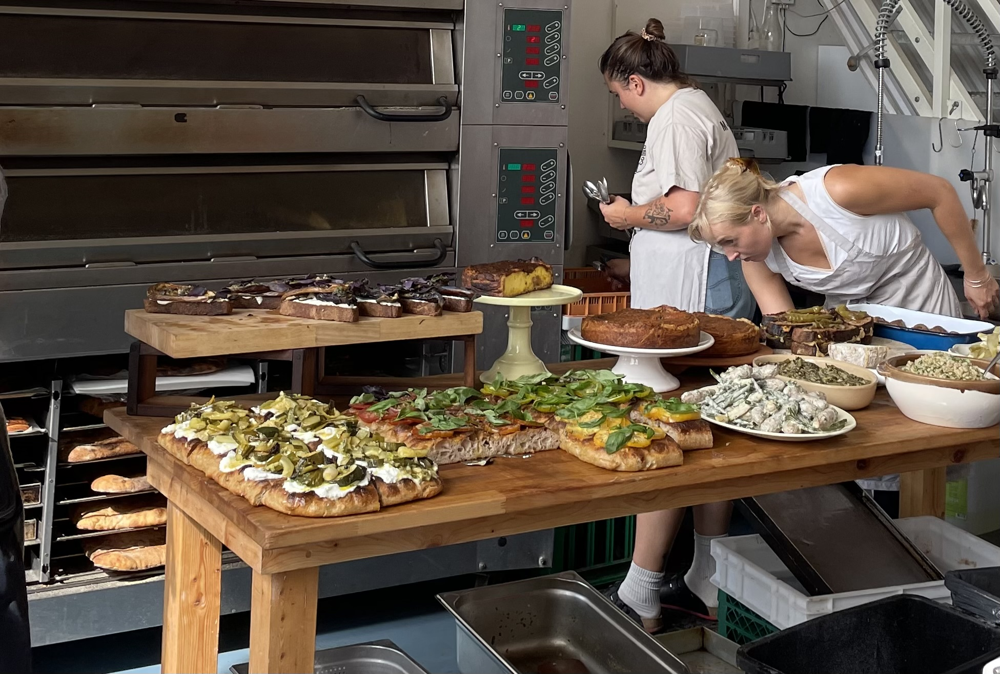
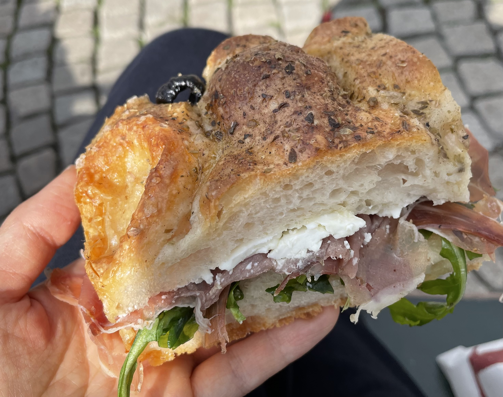
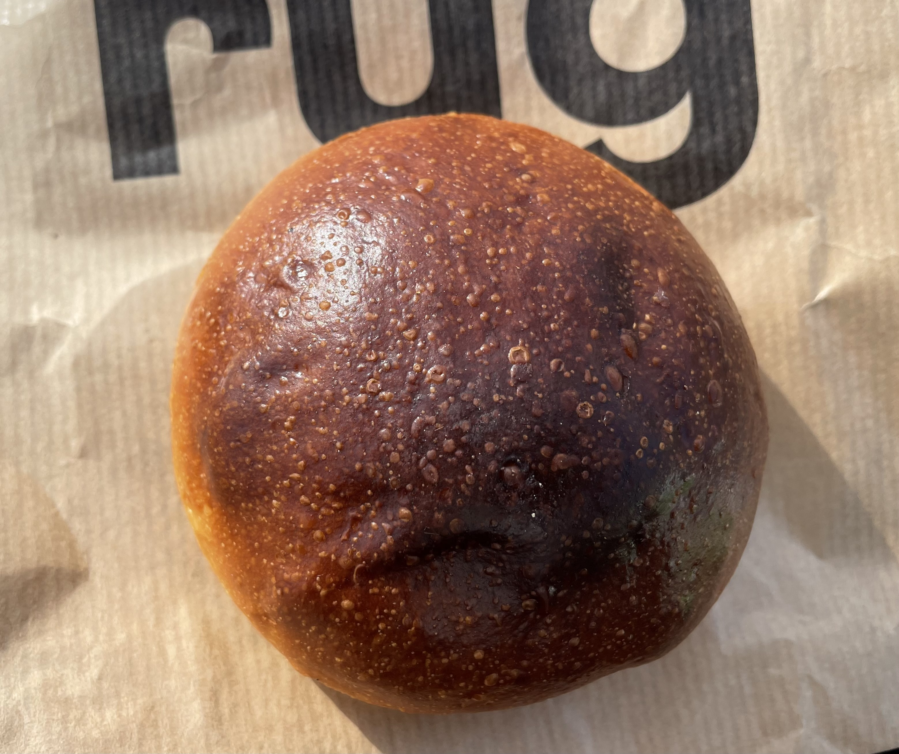
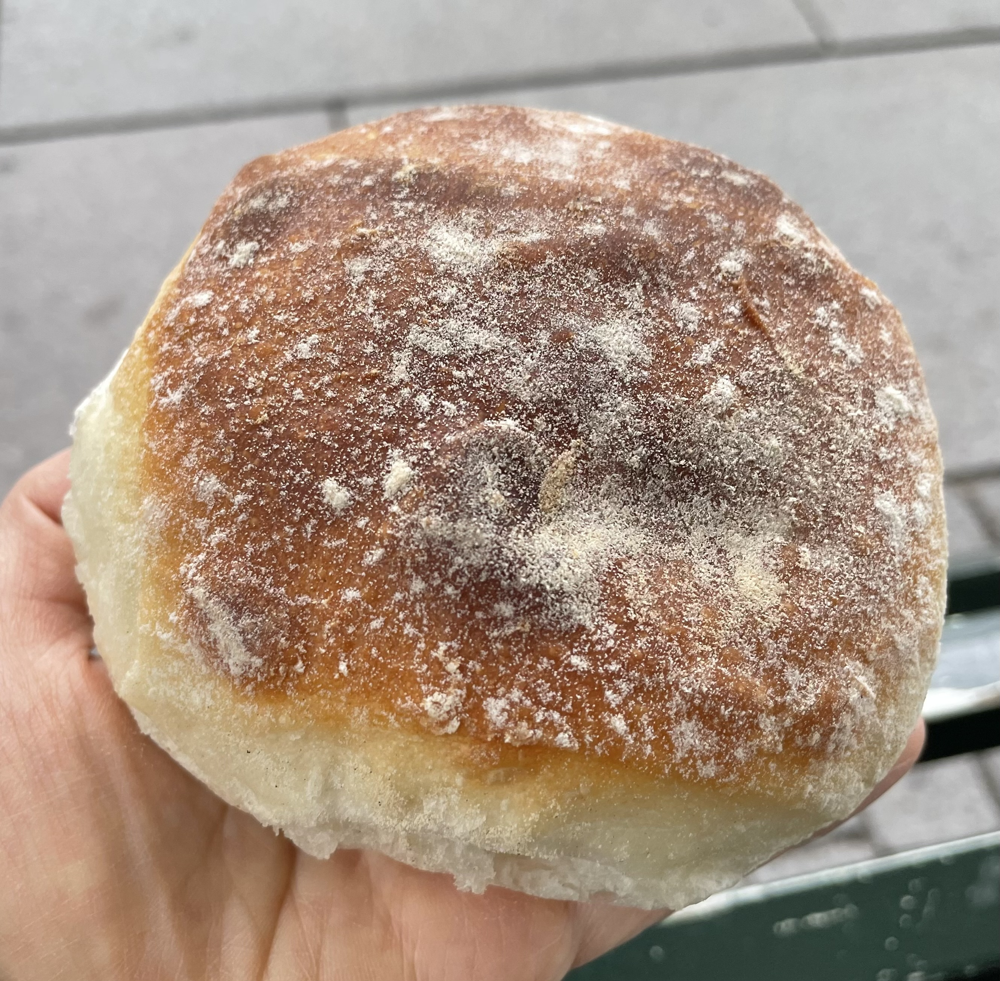
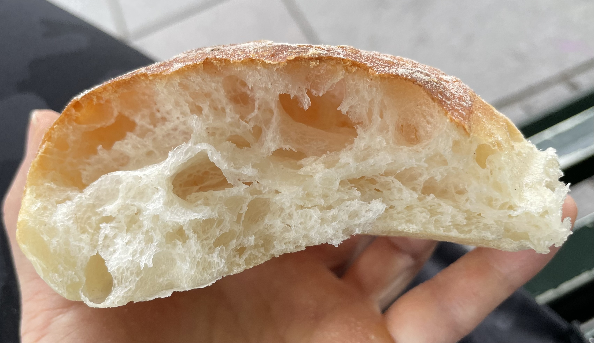
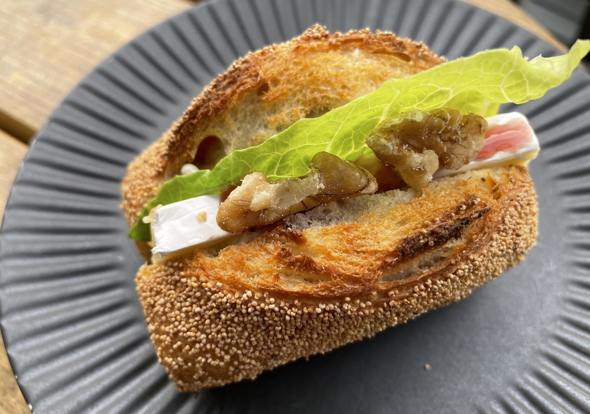
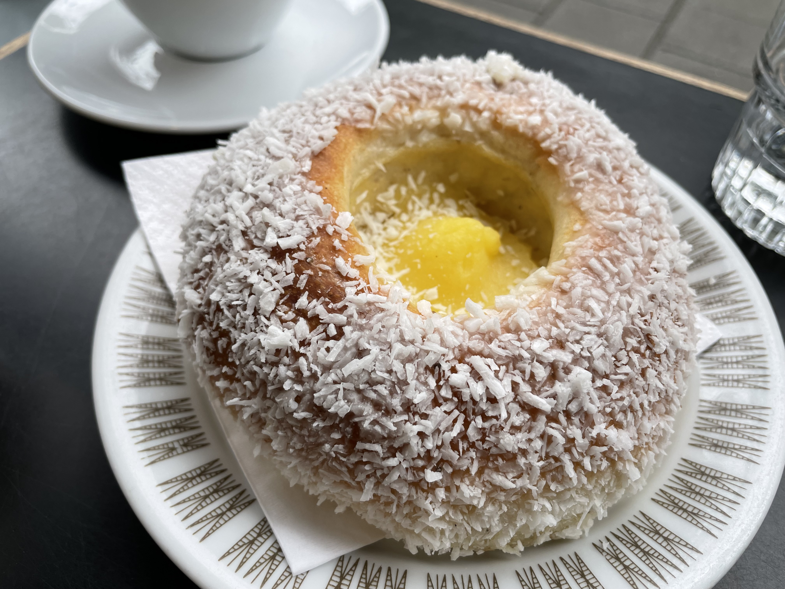

经过了漫长的准备，个中艰难按下不表，这趟蓄谋已久的北欧之旅终于在过去的这个八月成行。虽说大方向上是蓄谋已久，但其实临行前我还两眼一抹黑，除了机票酒店大致动向以外什么细节计划都没定，可以说是流程上简明扼要，心态上破罐破摔，近乎毫无计划地拎起包出门，然后意料之外情理之中地降落并立刻宣布此地为新的精神老家。

很多意外之喜。今天先写写bakery。在纽约逛bakery就发现北欧血统似乎异常高贵备受追捧，这趟半是有心溯源半是误打误撞，吃到了不少好东西，感觉自己脑子里很多pastry profiles也被重新奠基，标准水涨船高，回来后再也无法直视美式icing糊顶的cinnamon roll了（个人喜好shift别来杠我）。

## 哥本哈根

北欧烘焙天堂名副其实，哥本哈根算得上the crème de la crème，卷得无出其右。

### Hart Bageri

为什么先写它呢，因为短短不到两天里我去了三次。

一开始只是冲着Cardamom croissant去的（原因稍后再讲），合眼缘捎带试了Spandauer。第二次造访仍然有所克制，试了店里仅有的两款Financier和Black sesame cookie。第三次已经变成充满不舍地放肆点菜，最终抱着打包袋彻底沦陷在一只简单但堪称完美的Croissant里。救命，写下这串名字我竟又在流口水。

- **Pandan coconut financier** - 这家的financier都非常油润，质地出奇得松软，跟我financier都结实耐放的印象完全不符。斑斓味道不重，那股清新的香草香是在的，跟椰香很搭，这个组合一看就很泰很亲切。虽然表面撒了一层细糖粒，但这只反而清新大过甜腻。
- **Yuzu hazelnut financier** - 大意了，光看到柚子就开始脑补清新果香，但很遗憾坚果本人和坚果酱太抢戏了，根本品不出柚子味，就还挺甜腻的。
- **Black sesame cookie** - 看上去规规整整一块大cookie，结果一碰就要软软地碎掉，texture跟方才的financier反而更像了，一种娇弱的美，很反直觉（是的去之前我刚吃过Levain，就……同是cookie但已经无法扯上亲戚关系）。黑芝麻从内到外，面团里还揉了白巧进去，听起来就很甜对不对？吃起来也确实很甜，但有点讨喜，属于第二口就会齁住缓缓放下，但隔一会儿我又会想去掰一块这样的间歇治愈选手。
- **Passionfruit cake** - 磅蛋糕，但酸甜！浓缩的百香果味存在感极强，非常讨喜，果香冲淡了很多磅蛋糕的腻，但磅蛋糕的配方总归大家都懂……不能多吃。
- **Sausage roll** - 优秀的酥皮卷优秀的香肠，这能不好吃吗？这不能。冷吃热吃都好吃，我捶胸顿足买少了。

- **Spandaue**r - 喜欢蛋挞和danish的朋友不容错过，想象一下把蛋挞酥皮换成danish那种，挞液比例降低酥皮比例提高，让人很难不心动，怪不了我临时加单。
- **Cardamom croissant** - 它反而低于预期了。不过主要怪斯德哥尔摩，给所有跟小豆蔻沾边的pastry都奠定了过高的基调（下篇细说）！除却巫山不是云也是没办法的事。
- **Croissant** - 不想写了，好吃的Croissant什么样吃它就知道了，以上都可以不吃，只有它不能不吃。

当然了我对这家店有很大滤镜。晨起沿着河有一搭没一搭地走走跑跑，眼看着浓云越来越暗，雨点越来越密集，本来都想回去拿伞算了，但对比了一下距离，心一横就一路小跑过了大桥小桥去了。店里好几桌遛娃的年轻妈妈吃早饭，点单店员在我问spandauer怎么念的时候甜甜一笑（此情此景之下，我必然没记住答案！），整个人都从刚淋过一场雨的凌乱里回过神来了。

I’m so into this kind of impulsive visit.

Disclaimer：Hart有好几家分店，我只去了Holmen那家，nice and cute，无法保证更热门那家店如何。

### Lille Bakery

这家不仅红，还红得人尽皆知大排长队。在新乡看到bakery排这么长的队我是不给任何眼神的（对Librae说的就是你），但短短不到两天，这个去起来跟除了Hart Bageri以外的任何地方都不顺路的邻岛尽头的偏远小店（？）的这条每次都以龟速缓慢挪动的大长队，我排了两次。老实说，如果不是改机票太贵麻烦，我甚至想在lunch hour去第三次。

- **Sausage roll** - 跟Hart Bageri的Sausage roll明显不是同一挂，内陷是肉馅那个sausage而不是香肠，肉馅调味是很熟悉的香料组合，酥皮一碰就簌簌掉渣，撒小茴香点睛之笔。肉量感人堪称酥皮开口结实大包子！
- **Focaccia** - 含水量异乎寻常的大，以至于面团咕啾啾的质感非常神奇，从没在别处吃到过含水量如此之大同时发酵气孔如此精彩的面团。甚至有一瞬间我在怀疑是不是表面的番茄出水太多了……但想必也不会浸润整个面团吧不能吧？不懂，是我无法想象但十分好奇的technique。非常推荐一试！这也是我想在lunch hour（after 12pm）再去的原因，它只在这个时段有。
    

    
- **Berliner** - 长相和口感都很像donut，presentation是完整的但我不大喜欢。
- **Blomster bun** - 形似酥皮肉桂卷？但仔细吃好像不是肉桂，可能是肉桂小豆蔻或者也有其他香料的结合。texture介于roll和pastry之间，有点难以形容，整体我不是很喜欢。
- **Bread + butter + cheese + ham** 平实的好吃快手sandwich！面包非常出彩，闭眼选了multigrain的（根据我有限的data points店里每天/hour有的选项不太一样），texture和面香都令人感动。然后点它让我明白了为什么队又长挪得又慢呢，因为很多东西都是现点现做啊！高挑北欧美女在你面前轻巧切开面包，抹butter夹ham这样，赏心悦目心旷神怡，这个队就让后面的人慢慢等吧（不是）。

分不清名字的当日各色小bun就随便买吧都好吃。这家虽地处偏远但人气爆棚可见还是靠扎实的面包功底，pastry反而不是特别戳中我。现在回想起那块与众不同的Focaccia我还是疯狂挠头，到底如何能把面团发成那样啊教教我吧！

### BUKA

又一位造访两次的选手，同样好几家分店，我只去了离新港最近的那家。抱着顺路审判一下的平常心去吃，结果又让我运气极佳捡到一颗闪亮珍珠。

- **Focaccia sandwich** - 外脆内韧的Focaccia教科书一样标准，火腿+goat cheese馅料也很不错，符合想象的好吃，但第二天去的太早了还没出摊（不是）就也有点遗憾。

- **Cardamom bun** - 这个名字很有误导性，其实这只更像croissant而不是bun，again要怪就怪小豆蔻圣地斯德哥尔摩！
- **Apricot & ricotta croissant** - 对它就是那颗珍珠。短短一天塞了太多东西我的胃已经在默默哭泣，但切开它的时候还是一瞬间又在心里点起了小小火苗，底部的酥皮被馅料压住texture难以保证，不过没关系，和它上方的ricotta + 柔软湿润杏干 + 半颗糖水杏子 + 开心果碎sprinkle一起咬下去，会让人立刻想上天。乳酸菌的酸和杏干的酸非常搭，糖水杏子吃起来好像黄桃罐头哦，这一口酸甜果香爆炸在嘴里非常惊艳！万万没想到这竟然是此行吃过最清新脱俗的一只pastry。本来吃得很累了立刻就活过来了。然而为什么说它是珍珠呢，第二天去回购的那只很遗憾就完全不惊艳了，无他，中间那层杏干酸味弱了，搭起来就没那么惊喜。也是人之常情啦，就像没有两颗一模一样的珍珠一样，世上也难找同样酸的两颗杏干呢。

吃完最惊艳的这一口，吃的时候有多惊喜幸福，吃完站起来就有多撑。于是捧着肚皮去河边散步。汩汩的流水边有人躺在河边刷手机，旁边停着婴儿车。远处河上有疑似婚礼包场，热闹的气氛时不时浸透周围的水域。我也鬼使神差就着夜色躺下，已经是晚上十点半，仍能听到远处嘈嘈切切的聊天声、歌声和年轻女孩们肆意的大笑声。夜凉风轻里，一整颗心被熨得平平的，想说哥本哈根不愧是童话镇，恰如其分美妙得不像尘世。

side note：这家出名的pistachio croissant和貌美danish完全没来得及试，但有遗憾才有下次造访对不对。

### Rug Bakery

这家有点特别，竟有table service。一推开门立刻就被正经的富丽堂皇震慑了（不是），俨然误入贵妇下午茶。咳咳，其实上面几家也有不同程度的座位/table service，但相比之下显然Rug定位更庄严肃穆（？），刚插空停好自行车火急火燎满头大汗推门而入的我显得有点不合时宜。开玩笑啦，也有很多大包小包的游客的，大家随意。

- **Tea bun** - 圆圆一只小胖包，表层egg wash着色美丽，内里就是朴实无华的蛋香味甜面团。店员说就是配茶吃的简单小包，在柜台里介于隆重装饰的pastry和rustic的欧包之间，没有花里胡哨的装饰仿佛无甚特别，但浑然天成的presentation又有一丝精巧。入口平实妥帖，是会在脑子里啊原来是这样一声的好吃。
    

    
- **Cardamom bun** - 这只就是很传统的造型很经典的口味，下期跟它的亲戚们一起见。

这家店坐落于人潮拥挤的主火车站一个block开外，门开的方向倒是有点隐蔽容易错过。店员们都有一种贵价餐厅的composed气质，会认真询问to-go还是table service，以免排错队。下次想认真试试美丽pastry。

哥本哈根出名的店太多，而我这次能给它的时间太少，只恨自己没长八个胃。骑着小车穿梭于河道间，阳光和细雨交织间被风吹乱头发，心里不住盘算着下家点什么来吃，真是再轻巧也没有的记忆了。会让我一遍遍在脑海里回味那个时刻，一次次想开扇任意门闭上双眼踏进去。

## 斯德哥尔摩

落地当天还带着上班的疲惫心情，晚上八点还在兢兢业业跟美国这边开会，现在回想起来真是暴殄天物，身在福地还上什么班啊。当初本没抱什么必吃的决心，反而渐入佳境意外奠定了此次北欧之行探访bakery的high notes.

### Lillebrors Bageri

原来一头栽在Hart之前，我已经先在这里栽过一个大跟头了。先是连续三天每天造访，再是临走时极限打包，一共四次，别太爱了！

话虽如此，也不是百分百什么都好吃，各位看官酌情判断。

- 两只**bun**各有各的好吃。其中一只小小蓬蓬怪可爱的不像北欧风格反而像是日式小面包，问了店员这啥只听懂了是sourdough，咬一口，咦不止不酸甚至没什么味道，再咬一口，确实只有一点点盐味和若有似无的发酵香气。它与众不同的地方在于texture，含水量高异常轻盈同时回弹非常好，表皮比起日式包有一点韧韧的，但完全没有欧包那种粗粝的风格，内里的气孔大所以空气感十足，像咬了一口清淡的云，一种细致又虚无的妙。另一只表面更粗犷更欧式，皮也确实更厚些，但内里也是类似的大气孔，巴掌大一只吃下去却没太多实感，一种举重若轻的安慰。根本不会撑死人，很好！

- **Almond danish** - 拉低平均分的选手。酥皮是优秀的，杏仁片的火候看起来也不错，但杏仁香气几乎没有，杏仁酱总觉得哪里不对油味有点annoying，难道是杏仁放久氧化了？不过确实能感觉到这家店整体的风格就是没味儿（不是），糖给得非常克制，不像在美国吃的所有的almond croissant都是冲着齁死人去的。也许成也糖量败也糖量，味道清浅的结果就是油味儿反而存在感过强，感觉这一趟倒是真的不必专门来。
- **Croissant** - 没什么好特别评价的，教科书式的标准选手，of course this is where set the bar high.
- **Cardamom bun**和**Cinnamon bun**都令我嗷嗷大叫疯狂心动！详情请见下回分解🙇‍♀️

为什么去了四次只写出这么几条，当然是因为个别明星产品每次都要吃一遍！好吧还有一个原因是店面很小，大半面积都用作工作间，pastry展柜小小一面，能碰上什么产品出炉很看运气（和前面人会不会大手一挥把某个品项全部包圆）。可能会排一下队，但都不长，挪动的时候看工作间的baker给面团整形、往danish上挤卡仕达放莓果，甚至会想多看一阵。说到这里，貌美的danish没吃上，就还是有点心痒。

虽然可能不至于专门为了它再飞一趟瑞典，但确实是如果再去，会想住它附近，会想每天都去的店。

### Komet Cafe

距离city center好近但是那种闹中取静转过几个繁花街角步入安静居民区的社区小店，很适合坐在户外的可爱木椅子上边吃早饭边people watching。

- **Venus** - 第一天去的时候刚吃过午饭撑得我眼冒金星，眼花缭乱不知道该买哪只试一口，店员就推荐了这只**cardamom croissant**，只能说惊为天人，真的很配这个名字！第二次没买到，我泪流成河。
- **Suisse** - 是一条（？）巧克力酱夹心的danish，好吃是好吃的，但有点太甜了，胜在外貌特别，酥皮内里松软，入口虽然甜但不会过于厚重。
- **Brie sandwich** - 小方欧包里塞brie slice配菜加一点点睛的果酱和核桃，小方包看上去朴实无华甚至还有点过于扎实，结果韧劲和香气都满分，怎么回事啊，北欧人的baking技能树到底怎么点的，怎么能把普普通通小方包烤得这么好！我仔细品味，我疯狂嫉妒。

店里的毛茸茸大狗也非常可爱，会乖乖趴在店里客人的脚边任撸。这谁顶得住，属于违规广告了！

**Bonus**: Happy Atelier离这家不远，full of gluten free and vegan options，看起来也非常legit，献给好这口的朋友们。如有人吃到请告诉我水平如何。

可支配时间有限，明明地图上标记了成百上千bakery，结果在斯德哥尔摩太早遇到命中注定（？）反而没去探索太多未知。走过看过许多店，可能是时节不对的缘故Semla完全没吃到，就还挺遗憾的。这么说来瑞典老家也在我的心上留下了许多许多锚。

## 奥斯陆

### Fuglen

传说中NYT评选出的最好喝咖啡，也就不过如此嘛。到底是好喝的，只是没到世界第一好喝那么夸张！

- **Skoleboller (School bun)** - 很讨喜很好吃！甜甜软面包，表面裹一层椰蓉，中间窝一团卡仕达，看上去有点危险也许会很腻，但其实很有日式甜面包的风情！一口气吃掉整个我意犹未尽。挪威小朋友好幸福，去学校能吃到这种东西那我可能也会爱去。

说回咖啡，我有限的鉴赏能力只能说……flat white太奶了，比例不大对呢闭眼喝我会以为我点了杯拿铁。北欧这趟喝到的咖啡都小小杯，都没有decaf option，算单价的话都比美国佬的贵，一种北欧的骄矜！但我心服口服，确实平均水平都很不错。

### Backstube

一个遍地开花的连锁，便宜好吃，适合饿了碰到就随处来一口。扁扁的肉桂卷形态脱俗，意外得还不错，扁扁的形状反而容易烤出一点脆边，对面团发酵工艺的要求也相对低多了，一种性价比很高的聪明做法！再次给北欧baking industry鼓掌。

写到这里我已经词穷了，口水和眼泪齐流，只想回去再吃一口。本期节目就到这里，下次我们讲Cardamom bun，stay tuned！